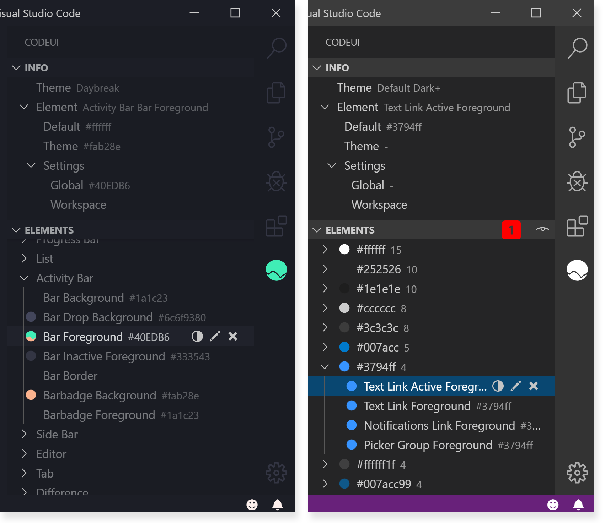
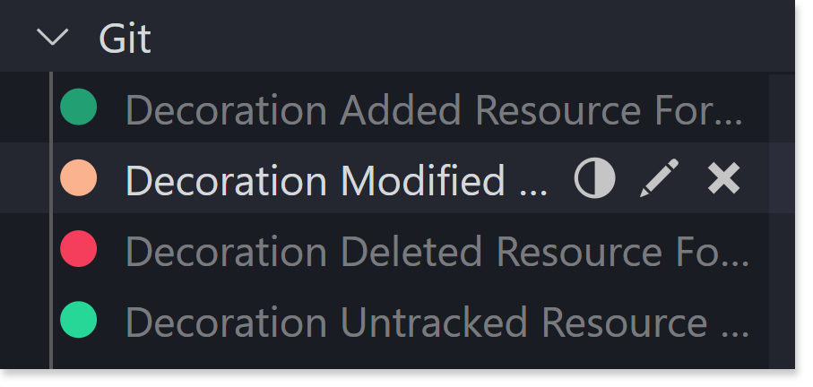
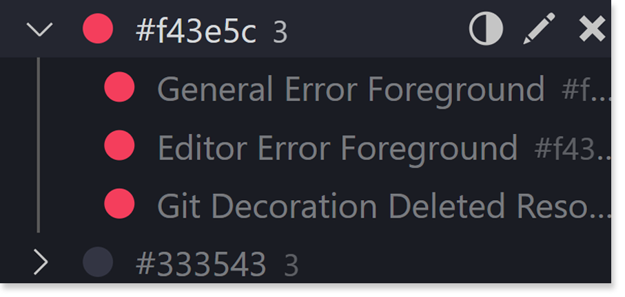
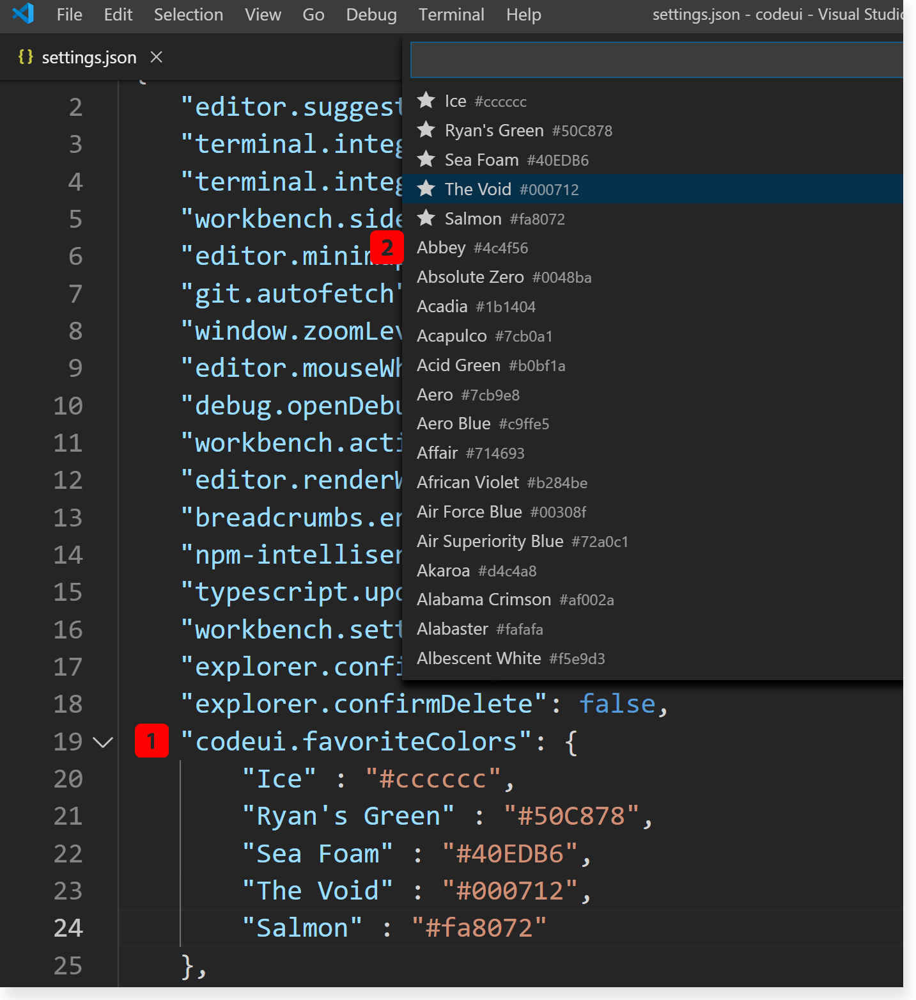

<p align="center">
  <a href="" rel="noopener">
 </a>
</p>

<h2 align="center">CodeUI</h2>

<div align="center">

  
  

</div>

<p align="center" style="font-size: 150%"> Build, edit, & explore your color theme for VS Code.
</p>

# Usage

## Table of Contents

- [Usage](#usage)
  - [Element Information](#element-information)
    - [Visualizations & Effective Color](#sup1sup-visualizations--effective-color)
    - [Tooltip Descriptions](#sup2sup-tooltip-descriptions)
    - [Info View](#sup3sup-info-view)
  - [Viewtypes](#viewtypes)
    - [Standard](#standard)
    - [Palette](#palette)
  - [Customization](#customization)
    - [Adjust brightness](#adjust-brightness)
    - [Customize](#customize)
    - [Delete](#delete)
    - [Copy](#copy)
  - [Colors](#colors)
    - [Favorites](#favorites)
    - [Presets](#presets)
    - [Allowable Values](#allowable-values)

# Element Information


## <sup>1</sup> Visualizations & Effective Color

   The icons for each item represent color setting, as well as indicate the source of those settings. If an icon is partially covered, the prominent color represents a customization (global or workspace) and the color underneath, if any, the next runner-up in this ascending priority scheme:
  
      Default -> Theme -> Customization (global) -> Customization (workspace)

   In the *Elements* view, items which are inherting color will also display the corresponding hex color-code. This value is indicative of the item's **effective** color, just like the prominent icon color.  

## <sup>2</sup> Tooltip Descriptions

   Hover over UI elements to view a description of each.

   *Please submit an issue [here](https://github.com/ryanraposo/codeui/issues/new?assignees=&labels=&template=tooltip-description-report.md&title=%5BTOOLTIP+DESCRIPTION%5D) for any descriptions found to be missing, incomplete, or inaccurate. Thank you!*

## <sup>3</sup> Info View

   The *Info view* displays the current theme as defined in your settings, and information about your selection in the *Elements view*. Select an element there to view the colors it is currently inherting.

# Viewtypes



*<sup>1</sup> Toggle views with the command button at the top right of the *Elements* view.*

## Standard

Allows browsing by element groups. These groups correspond to different parts of the editor, and their titles form the beginning of the values one might add to User Settings.

For example, the following value would be found under heading *Activity Bar*, as item *Foreground*:

```"activityBar.foreground"```

## Palette

 In this viewtype, elements retain a long form of the name as items are grouped by color. The configuration above would be listed as *Activity Bar Foreground*, grouped with all elements who share it's effective color.

 This viewtype enables you to make batch changes to elements and alter the palette of the editor as it appears. Palette mode also helps in identifying visible elements whose names you aren't familiar with. Use it to see your theme at a glance.

# Customization

## Commands

CodeUI features four commands for customizing your editor:

- Adjust brightness..
- Customize..
- Delete customization..
- Copy*

In **Standard** mode (below), these commands are accessible via buttons for each individual element:

*\*Copy is located in the context (right-click) menu.*



In **Palette** mode, the inline commands can be applied to both elements *and* palette groups:



## Adjust brightness

- Select an adjustment. (*eg Darken 10%*). Be aware that transparency (alpha) values in the color's hex code may exaggerate/diminish the effects of lightening & darkening.

- If a workspace is open, choose a customization scope (global/workspace). If no workspace is open, global scope will be assumed.

- Brightness adjustment is applied.

## Customize

- Select a customization method. You can either **Enter a value** or **Choose a preset**:
  - **Enter a value...** Input a valid hex color. See more in [colors.](#colors)

  - **Choose a preset...** Select a pre-defined color from a pre-loaded list of over 2k values, or a favorite color added to User Settings -> ```"codeui.favoriteColors"```

- If a workspace is open, choose a customization scope (global/workspace). If no workspace is open, global scope will be assumed.

- Customization is applied.

## Delete

- If a workspace is open, choose a customization scope (global/workspace). If no workspace is open, global scope will be assumed.

- Customizations are deleted.

## Copy

- The selected item's effective value is copied to clipboard. Reminder: Copy is found in the context (right-click) menu.

# Colors



## <sup>1</sup> Favorites

Use configuration ``codeui.favoriteColors`` to define a list of custom colors, using the format: 

      "codeui.favoriteColors": {
        "Ice" : "#cccccc",
        "Ryan's Green" : "#50C878",
        "Sea Foam" : "#40EDB6",
        "The Void" : "#000712",
        "Salmon" : "#fa8072"
      },

A name **must** be entered with each value. They will appear first during selection with a star to indicate an item is user-defined.

## <sup>2</sup> Presets

A list of 2k+ colors are provided for use. They (if any exist) will always appear below your favorites.

## Allowable values

Only hexidecimal color values can be used by both vscode and CodeUI. This extends to RGBA hex values.

### *Acceptable values:*

- #f2f2f2 ✔️
- #6c6f934d ✔️
- #000000 ✔️

### *Unacceptable values:*

- (22, 45, 90) ❌
- purple ❌
- (11, 22, 33, 0) ❌


*If configuration ``codeui.enableNotifications`` is set to ``true`` (default), you will be notified about problematic values on entry.*

